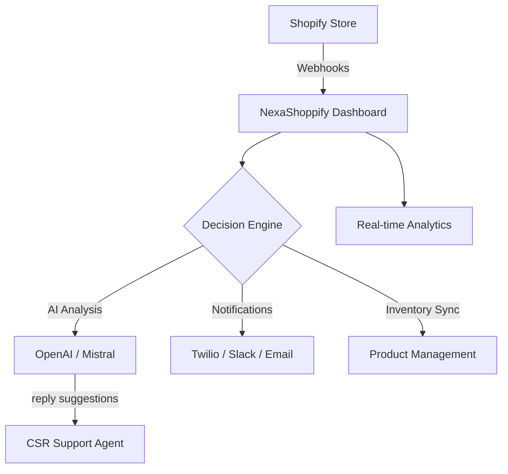

# NexaShoppify 🛒⚡

> **The Ultimate Shopify Automation & Intelligence Dashboard** — Engineered for scale, power, and seamless store management. Built with Next.js 14, React, Tailwind CSS, Recharts, and Zustand.


[](https://github.com/maliklogix/NexaShoppify)


---

## 🌟 Best Featured Project
NexaShoppify is not just a dashboard; it's a comprehensive automation engine. It bridges the gap between Shopify's robust commerce platform and cutting-edge AI (OpenAI, Mistral), providing merchants with unparalleled insights and efficiency.

### 🚀 Key Platform Capabilities

| Feature | Description | Status |
| :--- | :--- | :--- |
| **AI Support** | Integrated Chat with OpenAI GPT-4o & Mistral AI for smart replies. | ✅ Ready |
| **Automation Flow** | Rule-based triggers for SMS (Twilio), Slack, and Email (SMTP). | ✅ Ready |
| **Deep Analytics** | Real-time revenue tracking, funnel analysis, and device breakdown. | ✅ Ready |
| **Webhooks** | Enterprise-grade webhook management with failure logs and retries. | ✅ Ready |
| **CSR Management** | Advanced ticket queue system with AI-driven suggestions. | ⚡ Active |
| **Store Control** | Full management of Products, Orders, Customers, and Discounts. | ✅ Ready |

---

## 🏗️ System Architecture



---

## 🔥 Features Galore
- **Live Metrics**: Instantly view revenue, order volume, and pipeline health.
- **AI-Powered Customer Support**: Resolve tickets faster with AI suggestions.
- **Multi-Channel Automations**: Recover cart abandonments and notify teams instantly.
- **Enterprise Webhook Tracking**: Gain full visibility into every data sync.
- **Advanced Pricing Rules**: Create and manage complex discount strategies.

---

## 📈 Development Streak
We are committed to rapid iteration and excellence.

| Milestone | Phase | Details |
| :--- | :--- | :--- |
| **Day 1** | Foundation | Core architecture & Shopify API integration. |
| **Day 3** | Logic | Automation engine & Webhook management. |
| **Day 7** | Intelligence | AI Assistant & CSR Support Desk. |
| **Day 10** | Polish | Premium UI, Animations, and Optimization. |
| **Current** | Release | **v1.0.0 Stable Deployment** |

---

## 🛠️ Quick Start

### Installation
```bash
git clone https://github.com/maliklogix/NexaShoppify.git
cd NexaShoppify
npm install
```

### Configuration
Update your `.env.local` with your credentials:
```bash
cp .env.example .env.local
```

### Launch
```bash
npm run dev
# Open http://localhost:3000
```

---

## 📞 Get In Touch
I'm always open to discussing new projects, creative ideas, or opportunities.

- **Phone/WhatsApp**: `0315 8304046`
- **GitHub**: [maliklogix](https://github.com/maliklogix)
- **Portfolio**: [Check out my other projects!](https://github.com/maliklogix?tab=repositories)

---

## 📜 License
This project is licensed under the MIT License - see the [LICENSE](LICENSE) file for details.

---

### Deployment Commands Used
```powershell
git init && git add . && git commit -m "🚀 NexaShoppify — Shopify automation dashboard"
git remote add origin https://github.com/maliklogix/NexaShoppify.git
git branch -M main && git push -u origin main
```
