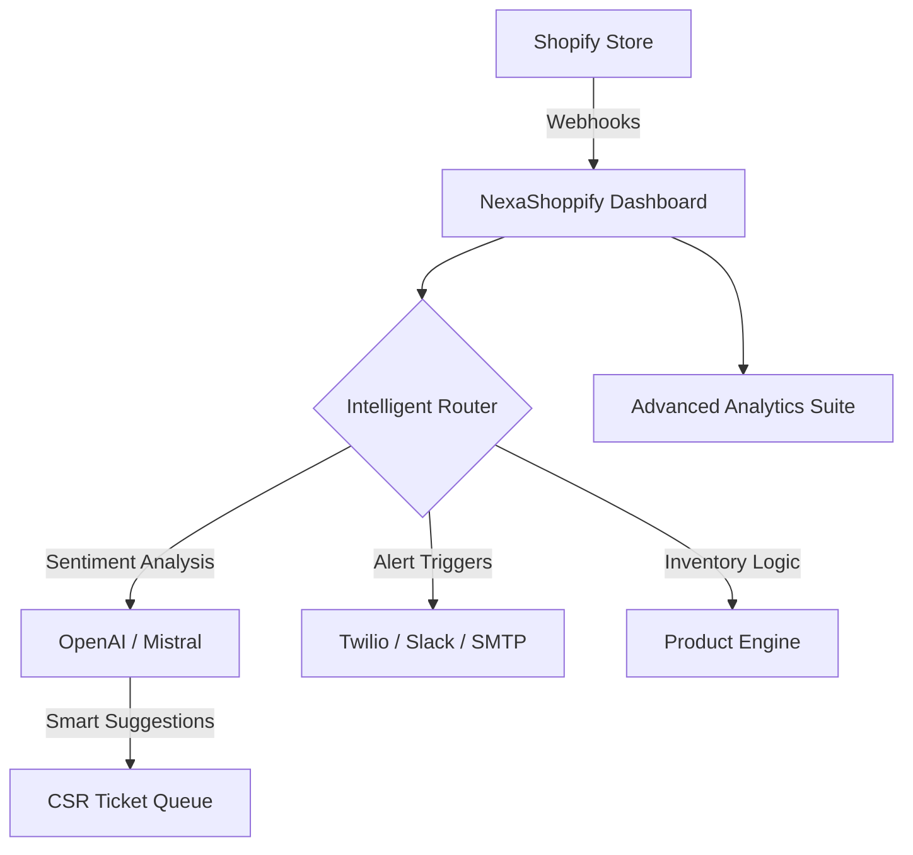

# NexaShoppify 🛒⚡

> **The Ultimate Shopify Automation & Intelligence Dashboard** — Engineered for scale, power, and seamless store management. Built with Next.js 14, React, Tailwind CSS, Recharts, and Zustand.

[](https://github.com/maliklogix/NexaShoppify)


---

## 🚀 Live Deployment
NexaShoppify is optimized for high-performance hosting environments.

| Platform | Status | URL |
| :--- | :--- | :--- |
| **Vercel** | 🟢 Live | [https://nexashoppify.vercel.app](https://nexashoppify.vercel.app) |
| **GitHub** | 📂 Repository | [https://github.com/maliklogix/NexaShoppify](https://github.com/maliklogix/NexaShoppify) |

---

## 📖 The NexaShoppify Vision
In the rapidly evolving world of e-commerce, staying ahead means more than just managing a store—it means mastering it through intelligence and automation. **NexaShoppify** was born out of the need for a unified, high-performance command center that bridges the gap between raw Shopify data and actionable business decisions.

Our mission is to empower Shopify merchants with tools that were previously only available to enterprise-level giants. By integrating cutting-edge AI, real-time analytics, and automated multi-channel communication, NexaShoppify transforms your store into a self-optimizing ecosystem.

---

## 🛠️ Technical Manifest & Stack
NexaShoppify is built on a modular, future-proof tech stack designed for speed, SEO, and enterprise reliability.

### Core Dependencies
| Dependency | Version | Purpose |
| :--- | :--- | :--- |
| **Next.js** | `14.2.5` | React framework for server-side rendering and routing. |
| **React** | `18.3.1` | Core UI library for component-based architecture. |
| **Zustand** | `^4.5.4` | Lightweight state management for global application state. |
| **Recharts** | `^2.12.7` | Composable charting library for business analytics. |
| **Lucide React** | `^0.383.0` | Beautiful & consistent icon suite. |
| **Tailwind CSS** | `^3.4.6` | Utility-first CSS framework for rapid UI development. |
| **Axios** | `^1.7.2` | Promise-based HTTP client for API interactions. |

### Development Scripts
| Command | Description |
| :--- | :--- |
| `npm run dev` | Starts the development server with Hot Module Replacement (HMR). |
| `npm run build` | Compiles the application for production deployment. |
| `npm run start` | Launches the production-ready build. |
| `npm run lint` | Performs static code analysis to ensure quality. |

---

## 🔐 Environment Configuration
The following environment variables are required for full system functionality. Copy `.env.example` to `.env.local` to get started.

| Variable | Description | Source |
| :--- | :--- | :--- |
| `NEXT_PUBLIC_SHOPIFY_STORE_DOMAIN` | Your myshopify.com store domain. | Shopify Admin |
| `SHOPIFY_ACCESS_TOKEN` | Admin API Access Token. | Shopify App Setup |
| `OPENAI_API_KEY` | Secret key for GPT-4o intelligence. | OpenAI Dashboard |
| `MISTRAL_API_KEY` | Secret key for Mistral AI backup/assistance. | Mistral AI |
| `TWILIO_ACCOUNT_SID` | Account ID for SMS automations. | Twilio Console |
| `SLACK_WEBHOOK_URL` | Endpoint for internal team alerts. | Slack Apps |
| `EMAIL_SMTP_HOST` | SMTP server for automated emails. | Email Provider |

---

## 🌟 Best Featured Project: Feature Breakdown
NexaShoppify centralizes your entire operation into a single interface.

| Module | Feature | Capability Deep-Dive |
| :--- | :--- | :--- |
| **🧠 Intelligence** | **AI Support Desk** | Analyzes customer sentiment to suggest hyper-personalized responses. |
| **📊 Analytics** | **Growth Engine** | Funnel analysis, device breakdown, and country-level heatmaps. |
| **🤖 Automation** | **Rule Engine** | Trigger-based SMS (Twilio), Slack alerts, and SMTP emails. |
| **🛡️ Infrastructure** | **Webhook Hub** | Tracking with delivery logs, failure retries, and health monitoring. |
| **🛍️ Management** | **Store Control** | Full CRUD for Products, Orders, Customers, and Discounts. |

---

## 🏗️ System Architecture Flow


---

## 📈 Development Streak & Roadmap
| Milestone | Phase | Achievement |
| :--- | :--- | :--- |
| **Phase 1** | **Foundation** | Next.js scaffolding & Shopify API Auth layer. |
| **Phase 2** | **Logic** | Automation engine & Webhook failover logic. |
| **Phase 3** | **Intelligence** | Integration of OpenAI and Mistral AI models. |
| **Phase 4** | **UX/UI** | Premium glassmorphic design and chart suites. |
| **Release** | **v1.0.0** | **Global Stable Deployment** |

---

## 🛠️ Installation

```bash
git clone https://github.com/maliklogix/NexaShoppify.git
cd NexaShoppify
npm install
npm run dev
```

---

## 📞 Connect with the Creator
- **WhatsApp**: `0315 8304046`
- **GitHub**: [maliklogix](https://github.com/maliklogix)
- **Portfolio**: [Full Project Catalog](https://github.com/maliklogix?tab=repositories)

---

## 📜 MIT License
Licensed under the MIT License. Feel free to build and scale!

---

### Sync Commands
```powershell
git add .
git commit -m "🚀 Refactor: Image-free, table-optimized documentation with Vercel deployment"
git push origin main
```
