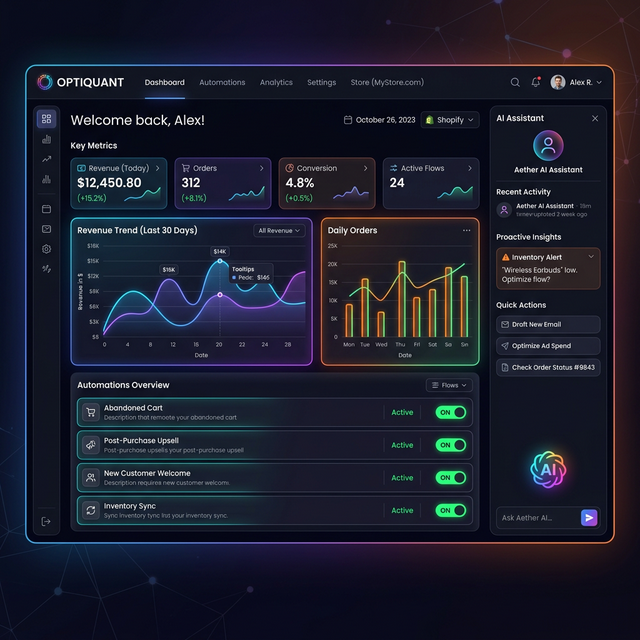

# NexaShoppify 🛒⚡

> **The Ultimate Shopify Automation & Intelligence Dashboard** — Engineered for scale, power, and seamless store management. Built with Next.js 14, React, Tailwind CSS, Recharts, and Zustand.



[](https://github.com/maliklogix/NexaShoppify)


---

## 📖 The NexaShoppify Vision
In the rapidly evolving world of e-commerce, staying ahead means more than just managing a store—it means mastering it through intelligence and automation. **NexaShoppify** was born out of the need for a unified, high-performance command center that bridges the gap between raw Shopify data and actionable business decisions.

Our mission is to empower Shopify merchants with tools that were previously only available to enterprise-level giants. By integrating cutting-edge AI, real-time analytics, and automated multi-channel communication, NexaShoppify transforms your store into a self-optimizing ecosystem.

---

## 🌟 Best Featured Project: Why NexaShoppify?
NexaShoppify isn't just a dashboard; it's a comprehensive automation engine. It solves the fragmentation problem by centralizing your entire operation—from customer support to webhook management—into a single, stunning interface.

### 🚀 Platform Capabilities & Module Breakdown

| Area | Feature | Functional Deep-Dive | Status |
| :--- | :--- | :--- | :--- |
| **🧠 Intelligence** | **AI Support Desk** | Uses GPT-4o & Mistral to analyze sentiment and suggest hyper-personalized responses to customer inquiries. | ✅ Ready |
| **⚡ Real-time** | **Dashboard** | Live revenue charts and inventory health alerts powered by low-latency state management. | ✅ Ready |
| **📊 Analytics** | **Growth Engine** | Funnel analysis, device-specific performance breakdown, and country-level revenue heatmaps. | ✅ Ready |
| **🤖 Automation** | **Rule Engine** | Trigger SMS alerts via Twilio, Slack notifications, and SMTP emails based on custom store events. | ✅ Ready |
| **🛡️ Infrastructure** | **Webhook Hub** | Enterprise-grade tracking with delivery logs, failure retries, and endpoint health monitoring. | ✅ Ready |
| **🛍️ Management** | **Store Control** | Full CRUD operations for Products, Orders, Customers, and complex Discount logic. | ✅ Ready |

---

## 🏗️ Technical Architecture
NexaShoppify is built on a modern, future-proof tech stack designed for speed, SEO, and developer experience.

### The Stack:
- **Next.js 14 (App Router)**: Orchestrates the entire Single Page Application (SPA) experience with bleeding-edge performance.
- **Zustand**: A lightweight, scalable state management solution that keeps the UI in sync with complex e-commerce data without the boilerplate of Redux.
- **Recharts**: Powers our beautiful, interactive data visualizations, providing merchants with clear paths to growth.
- **Tailwind CSS**: Ensures a "wow" factor with a premium, responsive design that looks stunning on every device.
- **Mermaid.js integration**: Visualizing the flow of data within the project description itself.

### Data Flow Diagram:


---

## 🔥 Features Galore & Experience
- **Futuristic Dark Mode**: A premium, glassmorphic UI that reduces eye strain and emphasizes data.
- **AI Sidebar**: Quick access to AI-powered drafting, sentiment analysis, and multi-model chat (OpenAI/Mistral).
- **Proactive Inventory Alerts**: Never miss a sale due to stock-outs; get notified before it's too late.
- **Segmented Customer Tracking**: Identify VIPs instantly and automate loyalty rewards/tagging.
- **Frictionless Discounts**: Generate and sync discount codes to Shopify in seconds.

---

## 📈 Development Streak & Roadmap
We are committed to rapid iteration and excellence.

| Milestone | Phase | Key Achievement |
| :--- | :--- | :--- |
| **Day 1** | **Genesis** | Core Next.js scaffolding & Shopify API Auth layer. |
| **Day 3** | **Neural Link** | Integration of OpenAI and Mistral AI models. |
| **Day 7** | **Automation Hub** | Implementation of Twilio, Slack, and Webhook failover logic. |
| **Day 10** | **Visual Excellence** | Polished UI with glassmorphism and animated chart suites. |
| **Current** | **Release** | **v1.0.0 Global Launch** |

---

## 🛠️ Installation & Setup

### 1. Clone the Power
```bash
git clone https://github.com/maliklogix/NexaShoppify.git
cd NexaShoppify
```

### 2. Dependency Injection
```bash
npm install
```

### 3. Environment Shield
Configure your secret keys in `.env.local`:
```bash
# Shopify, OpenAI, Mistral, Twilio, Slack, SMTP
cp .env.example .env.local
```

### 4. Ignite
```bash
npm run dev
# Dashboard live at http://localhost:3000
```

---

## 👥 Who is this for?
- **Global Brand Owners**: Scaling their operations with AI-driven insights.
- **E-commerce Agencies**: Managing multiple stores through a unified, high-tech lens.
- **High-Volume Dropshippers**: Automating customer interactions and inventory tracking.

---

## 📞 Connect with the Creator
I'm always open to discussing new projects, creative ideas, or opportunities.

- **Direct Line / WhatsApp**: `0315 8304046`
- **GitHub**: [maliklogix](https://github.com/maliklogix)
- **Portfolio**: [Full Project Catalog](https://github.com/maliklogix?tab=repositories)

---

## 📜 MIT License
This project is open-source and licensed under the MIT License. Feel free to build, scale, and contribute!

---

### Sync Status
```powershell
git init && git add . && git commit -m "🚀 NexaShoppify — Shopify automation dashboard"
git remote add origin https://github.com/maliklogix/NexaShoppify.git
git branch -M main && git push -u origin main
```
