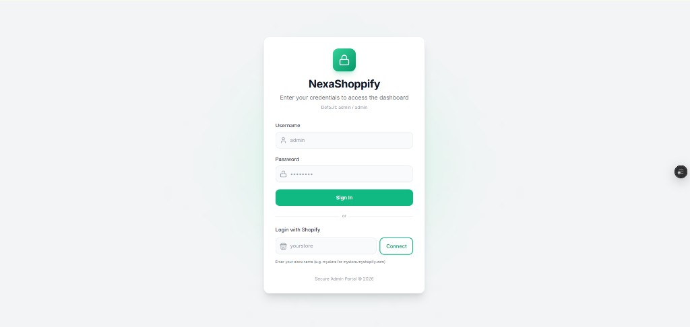
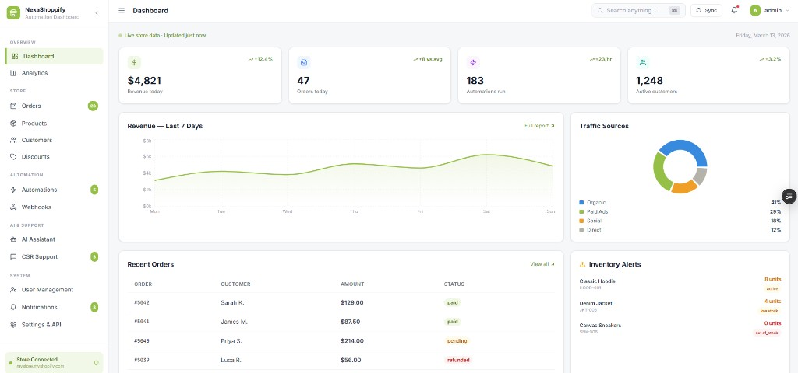
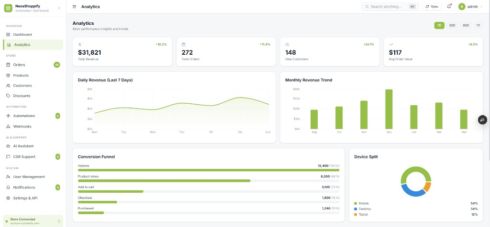
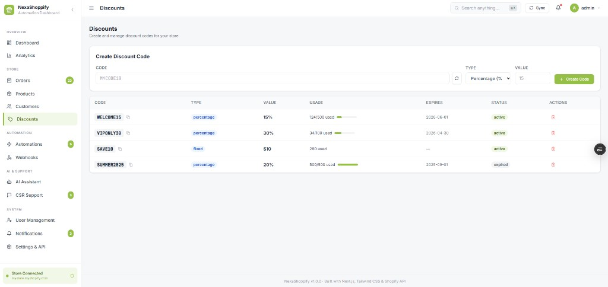
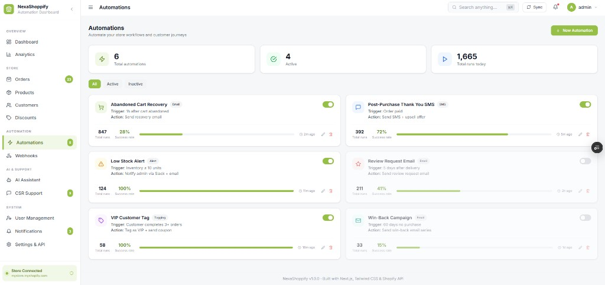
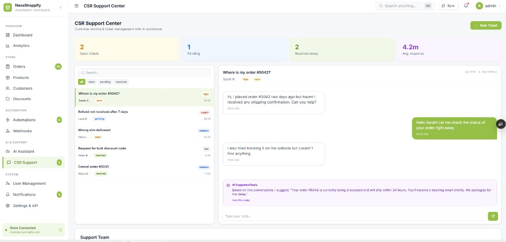
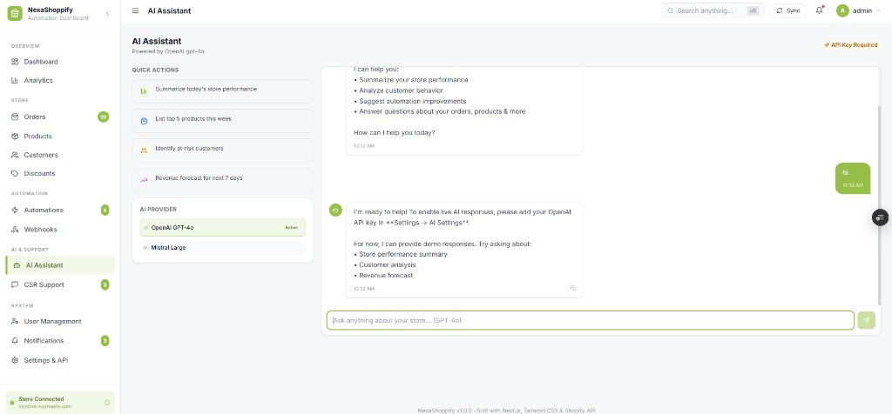

# NexaShoppify 🛒⚡

> **The Ultimate Shopify Automation & Intelligence Dashboard** — A full-stack command center for e-commerce: user management, Neon DB, AI-powered support, analytics, automations, and one-click Shopify OAuth.

[](https://github.com/maliklogix/NexaShoppify)
[](https://nextjs.org/)
[](https://reactjs.org/)
[](https://www.typescriptlang.org/)
[](https://tailwindcss.com/)
[](https://www.prisma.io/)
[](https://neon.tech/)

---

## 🚀 Live & Repo

| Platform | Status | Link |
| :--- | :--- | :--- |
| **Vercel** | 🟢 Live | [nexashoppify.vercel.app](https://nexashoppify.vercel.app) |
| **GitHub** | 📂 Repo | [github.com/maliklogix/NexaShoppify](https://github.com/maliklogix/NexaShoppify) |

---

## 📸 Screenshots

### Login — Credentials & Shopify OAuth

Default sign-in with **admin / admin**, or connect via **Login with Shopify** (store name → OAuth).



---

### Dashboard — Live metrics & revenue

Revenue today, orders, automations run, active customers; 7-day revenue chart; traffic sources; recent orders; inventory alerts.



---

### Analytics — Store performance

KPIs (revenue, orders, new customers, AOV); daily & monthly revenue trends; conversion funnel; device split.



---

### Discounts — Create & manage codes

Create percentage or fixed discount codes; table with usage, expiry, status; copy code and delete.



---

### Automations — Workflow engine

Abandoned cart, low stock, VIP tagging, post-purchase SMS, review requests, win-back; toggle active/inactive; runs and success rate.



---

### CSR Support — Tickets & AI suggestions

Open/pending/resolved tickets; conversation view; **AI Suggested Reply** for agents; metrics (avg response time, resolved today).



---

### AI Assistant — Store intelligence

Quick actions (performance, top products, at-risk customers, revenue forecast); OpenAI GPT-4o or Mistral; chat with demo or live API.



---

## 📖 Vision & Role

NexaShoppify is a **unified command center** for Shopify stores: one place for analytics, automations, AI support, user management, and store data — backed by **Neon PostgreSQL**, **UTC logging** (DB + file), and **Login with Shopify** for merchant onboarding.

Built to demonstrate **full-stack delivery**: Next.js 14, TypeScript, Prisma, Zustand, Recharts, and production-ready env-based configuration.

---

## 🛠️ Tech Stack

| Layer | Technology |
| :--- | :--- |
| **Framework** | Next.js 14 (Pages + App API routes) |
| **UI** | React 18, Tailwind CSS, Lucide React, Recharts |
| **State** | Zustand (persisted session) |
| **Database** | Neon PostgreSQL, Prisma ORM |
| **Auth** | Credential login + Shopify OAuth, role-based (Admin/User) |
| **AI** | OpenAI GPT-4o, Mistral (configurable) |
| **Integrations** | Shopify Admin API, Twilio, Slack, SMTP |

### Scripts

| Command | Description |
| :--- | :--- |
| `npm run dev` | Start dev server (HMR) |
| `npm run build` | Prisma generate + production build |
| `npm run start` | Run production server |
| `npm run lint` | ESLint |
| `npm run db:push` | Push Prisma schema to DB |
| `npm run db:seed` | Seed admin user (admin/admin) |

---

## 🔐 Environment Variables — How to Use

Copy `.env.example` to `.env.local` and fill values. Below is what each variable does and where to get it.

### Database (required for full features)

| Variable | Description | How to use |
| :--- | :--- | :--- |
| `DATABASE_URL` | Neon PostgreSQL connection string | Create a project at [neon.tech](https://neon.tech), copy connection string. Used for users, activity logs, chat logs, dashboard events, Shopify connections. |

### Shopify

| Variable | Description | How to use |
| :--- | :--- | :--- |
| `NEXT_PUBLIC_SHOPIFY_STORE_DOMAIN` | Store domain, e.g. `mystore.myshopify.com` | From Shopify Admin → Settings → Domains. |
| `SHOPIFY_ACCESS_TOKEN` | Admin API access token | Create a custom app in Shopify Admin → Settings → Apps and sales channels → Develop apps; install and copy token. |
| `SHOPIFY_API_KEY` | App API key | For “Login with Shopify” OAuth; from Shopify Partners app. |
| `SHOPIFY_API_SECRET` | App API secret | Same app; keep secret. Used to verify OAuth callback. |
| `SHOPIFY_WEBHOOK_SECRET` | Webhook signing secret | When registering webhooks in app. |
| `NEXT_PUBLIC_APP_URL` | App root URL | e.g. `http://localhost:3000` or `https://nexashoppify.vercel.app`. Used for OAuth redirect; set redirect URI in Shopify to `{NEXT_PUBLIC_APP_URL}/api/shopify/callback`. |

### AI (optional — for live AI Assistant & CSR suggestions)

| Variable | Description | How to use |
| :--- | :--- | :--- |
| `OPENAI_API_KEY` | OpenAI API key | [platform.openai.com](https://platform.openai.com) → API keys. Enables GPT-4o in AI Assistant. |
| `OPENAI_MODEL` | Model name | Default `gpt-4o`. |
| `MISTRAL_API_KEY` | Mistral API key | [mistral.ai](https://www.mistral.ai). Alternative to OpenAI. |
| `MISTRAL_MODEL` | Model name | Default `mistral-large-latest`. |

### Notifications & automation (optional)

| Variable | Description | How to use |
| :--- | :--- | :--- |
| `SLACK_WEBHOOK_URL` | Slack incoming webhook | Slack App → Incoming Webhooks. For internal alerts. |
| `TWILIO_ACCOUNT_SID` | Twilio account SID | [twilio.com](https://www.twilio.com) console. |
| `TWILIO_AUTH_TOKEN` | Twilio auth token | Same console. |
| `TWILIO_FROM_NUMBER` | SMS sender number | e.g. `+15550001234`. |
| `EMAIL_SMTP_HOST` | SMTP host | e.g. `smtp.gmail.com`. |
| `EMAIL_SMTP_PORT` | SMTP port | e.g. `587`. |
| `EMAIL_SMTP_USER` | SMTP username | Your email or app user. |
| `EMAIL_SMTP_PASS` | SMTP password | App password for Gmail/etc. |

**Minimal setup to run:** `DATABASE_URL` (or use fallback admin/admin without DB). Add Shopify keys for store data; add OpenAI/Mistral for live AI; add Twilio/Slack/SMTP for automations.

---

## 📖 How to Use the Project

### 1. Clone & install

```bash
git clone https://github.com/maliklogix/NexaShoppify.git
cd NexaShoppify
npm install
```

### 2. Configure environment

```bash
cp .env.example .env.local
```

Edit `.env.local`: set at least `DATABASE_URL` (from Neon). Optionally add Shopify, OpenAI/Mistral, and notification keys as above.

### 3. Database (Neon)

```bash
npx dotenv -e .env.local -- npx prisma db push
npx dotenv -e .env.local -- npx ts-node --compiler-options "{\"module\":\"CommonJS\"}" prisma/seed.ts
```

This applies the schema and creates the default **admin** user (password: **admin**). Without DB/seed, **admin / admin** still works in fallback mode.

### 4. Run the app

```bash
npm run dev
```

Open [http://localhost:3000](http://localhost:3000). You’ll be redirected to the login page.

### 5. Sign in

- **Username:** `admin`  
- **Password:** `admin`  

Or use **Login with Shopify**: enter your store name (e.g. `mystore`) and click **Connect** to go through Shopify OAuth.

### 6. Use the dashboard

- **Dashboard** — Revenue, orders, automations, customers; charts and recent orders.
- **Analytics** — KPIs, revenue trends, funnel, device split.
- **Orders / Products / Customers / Discounts** — Store management.
- **Automations** — Create and toggle workflows (email, SMS, alerts).
- **Webhooks** — Manage Shopify webhooks.
- **AI Assistant** — Chat about the store; add `OPENAI_API_KEY` or `MISTRAL_API_KEY` in Settings for live AI.
- **CSR Support** — Tickets and AI-suggested replies.
- **User Management** (Admin only) — Add/edit/delete users and roles.
- **Settings & API** — Configure API keys and store settings.

---

## 🌟 Features (recruitment-oriented)

| Area | What it shows |
| :--- | :--- |
| **Auth & users** | Credential login, Shopify OAuth, role-based access (Admin/User), user management CRUD, logout with activity logging. |
| **Data & logging** | Neon PostgreSQL, Prisma; activity logs (login/logout, user actions), chat logs, dashboard view events; UTC file logging in `logs/activity.log`. |
| **AI** | Configurable OpenAI/Mistral; AI Assistant for store Q&A; CSR AI-suggested replies. |
| **Analytics** | Revenue, orders, customers, AOV; charts (Recharts); funnel and device split. |
| **Automation** | Rule-based workflows, Twilio/Slack/SMTP integration, webhook hub. |
| **Store** | Orders, products, customers, discounts; Shopify API integration. |
| **UX** | Light, clean UI; responsive layout; Zustand state; toast notifications. |

---

## 🏗️ Architecture (high level)

```
Shopify Store ←→ NexaShoppify (Next.js)
                      ├── Auth (credentials + Shopify OAuth)
                      ├── Neon DB (Prisma): users, logs, Shopify connections
                      ├── AI (OpenAI / Mistral)
                      ├── Automations (Twilio, Slack, SMTP)
                      └── Analytics & dashboards (Recharts)
```

---

## 📈 Enhancements & Future Directions

Possible next steps to extend the project:

- **Multi-tenant:** Multiple stores per user; store switcher and scoped data.
- **Real-time:** WebSockets or SSE for live order/notification updates.
- **Advanced AI:** Fine-tuned prompts per store; sentiment in CSR; product recommendations.
- **Reporting:** Export PDF/CSV reports; scheduled email digests.
- **Mobile:** PWA or React Native app for on-the-go monitoring.
- **Audit:** Full audit log (who changed what, when) for compliance.
- **Rate limiting & security:** API rate limits, CSRF, stricter session handling for production.

---

## 👤 Author & Contact

**Malik Logix**

| Channel | Detail |
| :--- | :--- |
| **WhatsApp** | [0315 8304046](https://wa.me/923158304046) |
| **GitHub** | [@maliklogix](https://github.com/maliklogix) |
| **Portfolio / Projects** | [GitHub repositories](https://github.com/maliklogix?tab=repositories) |

Open to collaboration, feedback, and opportunities. Reach out via WhatsApp or GitHub.

---

## 📜 License

MIT License. Feel free to use and extend for learning or commercial projects.
